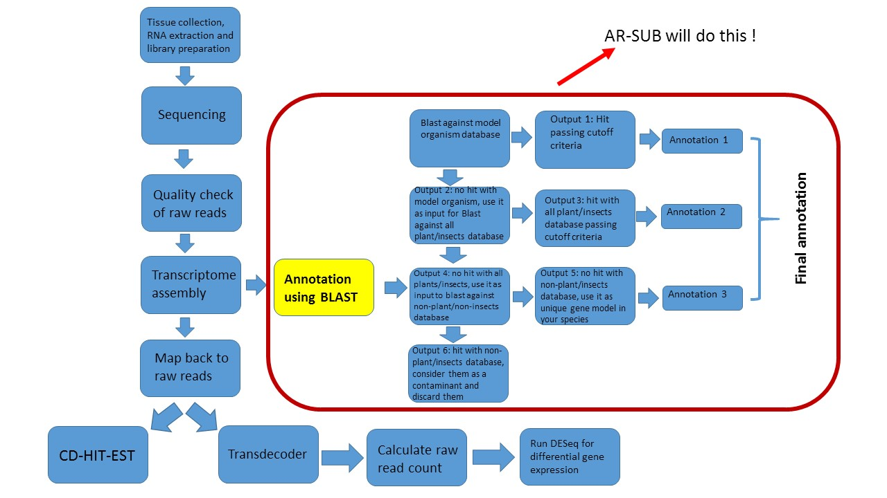
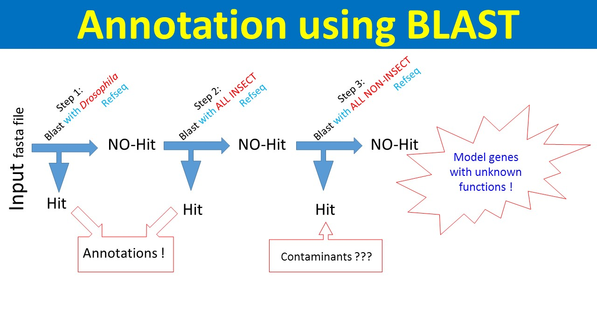

#Annotation of RNA sequencing data using BLAST  (AR-SUB) through Python

##Introduction
It is very useful to know about the presence and level of gene expression in any biological sample at certain stages and tissue type. Modern technique, RNA sequencing (RNA-seq), has enabled us to achieve this task quite well. Through RNA-seq it has been easier to look at cell's(or organism's) entire transcriptome. It has also enabled us to study about alternative gene spliced transcripts, post-transcriptional modifications, gene fusion, mutations/SNPs and changes in gene expression [(wikipedia link)](https://en.wikipedia.org/wiki/RNA-Seq ). Another very important field where RNA-seq is used intensively is gene annotation or de-novo predictions [(Zhen et. al. 2011)](http://bmcgenomics.biomedcentral.com/articles/10.1186/1471-2164-12-540).
Once we assemble transcriptome we will get contigs. These contigs will be input for annotation, which we do in NCBI’s BLAST (Basic Local Alignment Search Tool) (Figure 1). Genes that match to the closely related model organism is considered as homologous and that do not match with any organisms in database are classified as model genes specific to that organism [(Koonin et al., 2003)](http://www.ncbi.nlm.nih.gov/books/NBK20255/).





##What does AR-SUB do :question:
AR-SUB will align the assembled transcriptome fragments to the already annotated sequences available in NCBI database of various organisms. Usually, the gene annotation is done by running blast one querry at a time manually in NCBI web page or doing it in server and removing multiple hits in Microsoft excel manually. So, it is hugely time consuming and error prone as well (as we do it manually). with AR-SUB, it will be just three easy steps to get annotation of all the assembled transcriptome of any organism (Figure 2).




##Requirements and limitations
As AR-SUB was created in Linux operating system and high performance computing (HPC) system, to run this script there are some prerequisites. 

1.	Python version 3 or later are needed to run the program
2.	Most of the scripts use subprocess module to use linux command, so Linux OS is required 
3.	As we are aligning to all the nucleotide database in NCBI, we need BLASTn installed (either in the personal computer hard disc or in the super computer). 
4.	To make it perform faster HPC system is favored more.
5.	The program accepts .*fasta* files as input to do BLAST and gives gene annotations in tabular format.
6.	You need to run the program three times to get fully annotated genes from three stages (as shown in Figure 2). 

Nevertheless, all these requirements are for the best performance, so once they are met it is easy to get the output. Furthermore, as the input transcriptome assembly file is generally huge, the time consumed by the program to run will also be accordingly higher.


##How to get started  :+1:

1.	First, create a folder designated only to work for the gene annotation in your computer or high performance computing (HPC). Start with copying your assembled transcriptome *fasta* file in to this folder or give path .
2.	Download and move all files and scripts from the AR-SUB repository on GitHub into the folder you created in step 1. It is necessary to **keep all these files in the same folder** to run the program effectively!
3.	Download the file(s) of RefseqRNA data of the organism(s) that you want to BLAST to (subject data). These will be used to create database files for BLAST.
4.	Now, you are ready for the first BLAST (as in step 1 in figure 2)! In python interactive mode run the *ar_sub.py* file or submit as a *workq* job if you are working in HPC; this takes user inputs for the names of files in this order with a space in between:
     * a.	Name of the file to create database (*Drosophila*RNArefseq.fasta in step 1 in Figure 2)
     * b.	Name of input *fasta* file (query)
     * c.	Name of the file which you want to create for BLAST hits
     * d.	Name of the file which you want to create for BLAST non-hits (will be input *fasta* file for second BLAST)


5.	Relaunch the AR-SUB as in step 4 with following changes only in user inputs (as in step 2 in figure 2):
     * a.	Name of the file to create database ( AllinsectRNARefseq.fasta in step 2 in Figure 2)
     * b.	Name of input *fasta* file (no-hit file from first BLAST run)
     * c.	Name of the file which you want to create for BLAST hits 
     * d.	Name of the file which you want to create for BLAST non-hits (will be input *fasta* file for third BLAST)
     
6.	Relaunch the AR-SUB as in step 4 with following changes only in user inputs (as in step 3 in Figure 2):
     * a.	Name of the file to create database ( Allnon-insectRNARefseq.fasta in step 3 in Figure 2)
     * b.	Name of input *fasta* file (no-hit file from second BLAST run)
     * c.	Name of the file which you want to create for BLAST hits 
     * d.	Name of the file which you want to create for BLAST non-hits (which will be gene model for the organism)
     
7.  Now, the files from first hit and second hit will be the annotations for the transcriptome, and third non-hit will be model genes specific to that organism.

####Preview of running code:

```python
>>>python ar_sub.py -h
usage: ar_sub.py [-h]
                       input_file_to_creat_database query_file
                       uniquehit_model_organism no_hit_model_organism

positional arguments:
  input_file_to_creat_database
                        Give the file path of the file you need to make
                        database
  query_file            Give the fasta query file you want to blast with
                        database
  uniquehit_model_organism
                        Give the name of uniquehit output file
  no_hit_model_organism
                        Give the name of uniquehit output file

optional arguments:
  -h, --help            show this help message and exit
 
>>>python ar_sub.py drs.fasta faw.fasta uniqhit nohit.fasta
```
Legend:

ar_sub.py = python script file 
drs.fasta = input_file_to_creat_database
faw.fasta = query_file
uniqhit = uniquehit_model_organism
nohit.fasta = no_hit_model_organism


##References 
1.	[https://en.wikipedia.org/wiki/RNA-Seq](https://en.wikipedia.org/wiki/RNA-Seq)

2. [Koonin, E. V., & Galperin, M. Y. (2003). Evolutionary concept in genetics and genomics. In Sequence—Evolution—Function (pp. 25-49). Springer US.](http://www.ncbi.nlm.nih.gov/books/NBK20255/)
3. [Li, Z., Zhang, Z., Yan, P., Huang, S., Fei, Z., & Lin, K. (2011). RNA-Seq improves annotation of protein-coding genes in the cucumber genome. BMC genomics, 12(1), 1.](http://bmcgenomics.biomedcentral.com/articles/10.1186/1471-2164-12-540)
